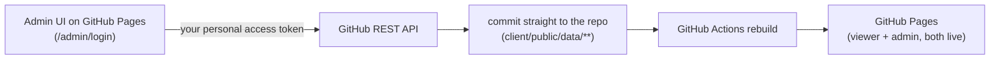
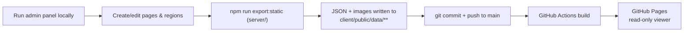

# Interactive Gemara Page Viewer

A web app for displaying scanned Gemara (Talmud) pages with interactive, invisible-by-default
hotspot regions overlaid on top of the original page image. An authenticated admin panel lets you
draw rectangle and polygon regions on a page image and attach a video, image, or text explanation
to each one. The public viewer renders those hotspots responsively, at any screen size, without
ever modifying the source image.

## Stack

- **Backend**: Node.js + Express + TypeScript, SQLite (`better-sqlite3`), JWT session cookies,
  `bcryptjs` password hashing, `multer` for image uploads.
- **Frontend**: React + TypeScript (Vite), React Router, Tailwind CSS v4, `dompurify` for sanitizing
  admin-authored text/HTML content before rendering it publicly.
- **Video**: embedded via YouTube/Vimeo iframe (URL is normalized to an embed URL automatically) —
  no video hosting/bandwidth cost. Direct file URLs also work as an `<iframe>` fallback.

## Project layout

```
server/   Express API, SQLite data model, auth, file uploads
client/   React admin panel + public viewer
```

## Data model

- **Page**: `tractate`, `daf`, `side` (`a`/`b`), `pageImageUrl`, optional natural image dimensions.
- **UpcomingBook**: a volume announced on the shelf before any of its dapim exist — `tractate`,
  optional `note`, `sortOrder`. It renders faded, unclickable, and banded "בקרוב".
- **Video**: a standalone educational video shown on the `/videos` rail — `title`, optional `description`,
  `url` (YouTube/Vimeo), `sortOrder`. Unlike a region's video, it isn't attached to any daf.
- **Region** (belongs to a page): `shape` (`rectangle` | `polygon`), `coordinates` stored as
  **percentages** of image width/height (not pixels) so hotspots stay aligned at any screen size,
  `contentType` (`video` | `image` | `text`), `content`, optional `title`.
  - Rectangle coordinates: `{ x, y, width, height }` (percent).
  - Polygon coordinates: `{ x, y }[]` (percent), minimum 3 points.

## Getting started

### 1. Backend

```bash
cd server
cp .env.example .env
```

Edit `.env` and set:
- `JWT_SECRET` — a long random string (e.g. `openssl rand -hex 32`)
- `ADMIN_USERNAME` / `ADMIN_PASSWORD` — the initial admin login. The admin account is created
  automatically the first time the server starts (only if no admin account exists yet).

```bash
npm install
npm run dev      # starts on http://localhost:4000
```

### 2. Frontend

```bash
cd client
npm install
npm run dev      # starts on http://localhost:5173, proxies /api and /uploads to :4000
```

Visit `http://localhost:5173` for the public viewer, or `http://localhost:5173/#/הנהלה` to sign in
and manage pages (unauthenticated visitors are redirected to the login screen).

### Production build

```bash
# server
cd server && npm run build && npm start

# client
cd client && npm run build   # outputs static files to client/dist, serve with any static host
```

To publish this to GitHub Pages instead (no backend hosting required, admin editing optionally
included — see below), see [Deploying to GitHub Pages](#deploying-to-github-pages).

## Admin workflow

1. **Admin → New Page**: enter tractate/daf/side and upload the scanned page image.
2. You're dropped into the **Region Editor**:
   - **Rectangle mode**: drag to draw.
   - **Polygon mode**: click to place each point; a rubber-band line follows the cursor to the
     last point. Close the shape by clicking near the starting point, double-clicking, or
     pressing **Enter**. **Escape** cancels the in-progress polygon.
   - **Select mode**: click a region to edit it in the side panel (title, content type, content).
     Drag the body to move a region; drag a rectangle's corner handles to resize; drag a polygon's
     vertex handles to reshape it; double-click a vertex to delete that point (leaving ≥3 points);
     press **Delete/Backspace** or use the "Delete region" button to remove a whole region.
3. **Save regions** sends the full region list to the backend as JSON, with coordinates normalized
   to percentages of the original image dimensions.

## Daf numbering

Daf numbers are stored as integers because they have to sort, but a Gemara is never *said* in
digits — daf 54 is נ״ד. `utils/gematria.ts` converts on the way out, with the usual typographic
marks (geresh on a single letter, gershayim before the last of several) and the conventional
ט״ו / ט״ז rather than the spellings of the Divine Name. `formatDaf()` composes that with the amud
(ע״א / ע״ב). Admin forms still take a plain number, since that's what's sensible to type.

## Interface language

The UI is Hebrew throughout, with `<html lang="he" dir="rtl">`. A few things follow from that and
are worth knowing before editing the UI:

- Use logical CSS utilities (`ms-`/`me-`, `ps-`/`pe-`, `start-`/`end-`, `text-start`/`text-end`)
  rather than physical left/right ones, so layout stays correct in both directions.
- Direction arrows are drawn with `<Chevron toward="start|end">`, not typed as characters. The
  obvious glyphs (`‹ › ← →`... specifically the angle quotes) are **bidi-mirrored**, so in an RTL
  document they silently render the opposite way and stop matching the control they sit on.
- A tractate name is Hebrew while its daf ("54b") is Latin. Rendering them as one string lets bidi
  reorder the pieces, so on-screen titles go through `<DafTitle>`, which isolates the name in a
  `<bdi>`. `formatPageTitle()` remains for alt text and aria-labels, where bidi doesn't apply.
- Arrow-key and swipe navigation in the viewer are mirrored: the *next* daf lies to the left.

## Videos rail

`/videos` shows standalone educational videos as plaques hanging from an aged wooden beam, scrolled
horizontally with snap points. Manage them at `/admin/videos` (linked from the admin dashboard):
add, edit, reorder, delete. In `github` admin mode each change commits `client/public/data/videos.json`;
in `express` mode they're rows in the `videos` table, exported to that same JSON by
`npm run export:static`.

Posters: YouTube encodes one in the video id, so it's derived synchronously. Vimeo doesn't, so it's
fetched from Vimeo's public oEmbed endpoint — no API key, and it sends `Access-Control-Allow-Origin: *`,
so the browser calls it directly with no backend involved. Results are cached per video for the life
of the page, and anything that can't be resolved (a private video, a host we don't recognise, a
network failure) falls back to the site mark rather than an empty frame.

### The arrows

Pressing an arrow carries the rail **one plaque onward**, smoothly, and the track's
`scroll-snap-type: x mandatory` settles it centred — so a press behaves like an ordinary scroll that
happens to stop in the right place.

Two things make that work that are easy to get wrong:

**Direction.** The rail reads right-to-left, and in RTL `scrollLeft` runs from `0` down to
`-(scrollWidth - clientWidth)`. Scrolling *onward* there means going **negative**. The step takes
its sign from the computed `direction`, so it moves the right way under either writing direction.

**Accumulation.** `scrollBy` measures from wherever the rail has got to, which mid-glide is a
half-finished position — so pressing three times quickly used to collapse into roughly one plaque of
travel. The arrows keep the position they're steering *towards* and add to that, then `scrollTo` it,
so a second press adds a plaque the way a second flick of a wheel adds to a scroll already running.
Any `pointerdown` or `wheel` on the track drops that target: once a hand is on the rail, the hand
decides where the rail is.

The step is measured off a live plaque (`offsetWidth` plus the track's `column-gap`) rather than
assumed, since a card is `min(19rem, 78vw)` and so is a different width on a phone than on a desk.
It's `offsetWidth` and not the bounding rect because the plaques are scaled while they settle in and
again on hover, and a transformed rect would make the step wander.

## Turning a daf

A Gemara leaf carries amud א on its front and amud ב on its back, and `DafTurner` models exactly
that: the turning element is a genuine two-sided leaf — outgoing daf printed on the front, incoming
on the back — swinging a full 180° about the right-hand binding, which is where a Hebrew volume is
bound. Past 90° the back face comes into view and lands on the copy already sitting underneath, so
the turn resolves seamlessly instead of cutting.

Depth comes from three things working together: the leaf lifts off the spine (`translateZ`) at the
midpoint so it arcs rather than wiping flat; a sheen sweeps each face as it passes through the
vertical; and the raised leaf throws a shadow across the page beneath it that retracts as it lands.
Neighbouring daf images are preloaded so a turn never reveals a blank.

## Routes

All paths live in `client/src/routes.ts`, so moving a screen means editing one line rather than
hunting for stragglers across links, redirects, and guards.

The admin area sits under **`/הנהלה`** rather than the guessable `/admin`, to keep it out of the way
of casual visitors:

| | |
|---|---|
| `/` | the library |
| `/view/:pageId` | a daf |
| `/videos` | the videos rail |
| `/הנהלה` | admin dashboard |
| `/הנהלה/כניסה` | admin sign-in |
| `/הנהלה/דפים/:pageId` | region editor |
| `/הנהלה/סרטונים` | manage videos |
| `/הנהלה/בקרוב` | manage announced volumes |

Anything else — including the old `/admin` — renders the ordinary not-found page, so a guessed
admin URL looks no different from any other typo.

### The not-found page

A wrong address is answered in the idiom of the sefer rather than the browser's. The page is a
leaf torn out of the volume — there is no daf 404, so the daf it would have been is shown missing,
ripped along its foot:

> הגעת לדף
> **404**
> נשארו לך עוד 2,298 דפים לסיים את הש״ס
> [ יאללה ]

The count is real. The Bavli is reckoned at **2,702 dapim** — the gematria of בראשית — so a reader
standing on daf 404 has exactly 2,298 to go. `NotFound.tsx` keeps the subtraction rather than the
answer, so the arithmetic stays checkable instead of being a magic number.

The 404 also carries **ת״ד** in the margin, the way every real daf here is named (see
[Daf numbering](#daf-numbering)). That gloss is what turns the number from an HTTP status into a
daf, which is what lets the line underneath land as a joke about learning rather than an error
message. It's `aria-hidden`: the digits have already been announced, and a screen reader would
otherwise read the letters as a word.

The tear is a `clip-path` polygon on a pseudo-element rather than on the sheet itself, because
`clip-path` on the sheet would clip away its own `box-shadow`; the shadow lives on the parent as a
`drop-shadow` filter so it follows the rip instead of tracing a rectangle. The polygon's points
vary in spacing as well as depth — evenly spaced ones read as a sawtooth, not as torn paper.

**This is obscurity, not access control, and it is not what keeps the site safe.** Anyone who
reaches the admin page still cannot change anything without a GitHub token that can push to this
repo, and it is GitHub, not this app, that rejects them. Treat the path as tidiness and the token
as the lock. Renaming it does not remove the need to scope that token to this one repository.

## Welcome guide

First-time visitors get a five-step tour explaining what the site is and how to use it: choosing a
volume, clicking regions on a daf, paging between dapim, and the videos rail. Each step is
illustrated with a working miniature built from the same surfaces the real screens use — a little
shelf with a volume being lifted, a daf with a pulsing region and a tapping cursor, a leaf actually
turning — rather than generic icons.

It can be skipped at any point from the button on the illustration, by pressing Escape, or by
clicking outside the card; any of those marks it seen (`gemara_guide_seen_v1` in `localStorage`) so
it never reappears uninvited. The `?` in the header reopens it on demand, always from step one.
Arrow keys move between steps (left advances, matching the RTL daf navigation), Tab is trapped
inside the dialog, and the page behind is locked from scrolling while it's up. It never mounts on
`/admin` — an editor signing in doesn't need a walkthrough of the public site.

Bump the key's version suffix in `GuideContext.tsx` to show a revised tour to existing readers.

## The bookcase

`/` groups the published dapim by tractate and stands them as bound volumes in a recessed case —
back panel, lit front plank, and light spilling from the front of the shelf. Bindings and heights
come from a stable hash of the tractate name, so a given volume always looks the same. Clicking one
opens it at its first published daf.

Volumes managed at `/admin/upcoming` stand alongside them, faded and banded "בקרוב", to show what's
coming. They're rendered as plain `<div>`s rather than buttons, so they aren't focusable or
clickable — the styling and the semantics agree that there's nothing to open yet.

## Marking hotspots by type

A reader needs to know what's behind a hotspot before spending a click on it, so every region
carries a small always-visible badge naming its kind:

| | | |
|---|---|---|
| **סרטון** | video | teal, play glyph |
| **הסבר** | text | ochre, lines glyph |
| **תמונה** | image | plum, picture glyph |

**Each type has its own glyph as well as its own hue.** Colour alone would leave anyone who can't
separate these hues with no way to tell a video from an explanation — the icon carries the meaning
and the colour reinforces it. The type is in the `aria-label` too, so it's announced rather than
merely seen. The hues are muted deliberately: they sit on a scanned parchment page without
shouting over the text.

The region body itself stays discreet until hovered. **"הצגת כל האזורים בדף"** outlines every
hotspot in full, tinted and dashed by type — off by default so the daf isn't cluttered, and
remembered in `localStorage` once chosen, since a reader who wants the map shouldn't have to
re-enable it on every daf. A legend above the page says what the colours mean.

### Browsing a daf by type

The legend isn't only a key — each entry is a button carrying that type's count on this daf, and
choosing one opens a floating list of every region of that kind: all the videos under **סרטון**,
all the images under **תמונה**, all the explanations under **הסבר**.

This answers a question the badges can't. They say *where* things are but not *what* they are, so
"which videos are on this daf?" otherwise means hunting the page for teal squares and opening each
one. The list gives titles up front — plus a one-line preview of the text for explanations, since
their titles are often absent or terse.

Each row does two different things, which is why it's two buttons:

- The row itself **locates** the region: the panel closes, the daf scrolls the region into view,
  and the region and its badge pulse for a moment so the eye catches them. This is the request the
  panel exists for — showing the reader the spot the item was taken from — so it's the larger,
  default target.
- **"צפייה"** skips the page and opens the content outright, for a reader who wants the video, not
  its location.

The flag is a timed class rather than a persistent state (`LOCATE_FLAG_MS`), so nothing has to be
dismissed; the pulse fades on its own. Locating uses `data-region-id` (falling back to
`data-badge-region-id`, since a badge may be dragged far from a small region), and the pulse is
suppressed under `prefers-reduced-motion` — the outline still appears, it just doesn't throb.

A type with nothing on the daf renders as a disabled chip showing `0`: still a legend entry
explaining the colour, but plainly not a way in.

### Placing a badge

By default a badge sits at the region's reading-order corner (its right edge, since the page is
RTL) or, for a polygon, at the centre of its vertices. That often lands on the text it points at,
and which spot is clear is a judgement about that particular daf — so it's placed by hand rather
than guessed.

In the region editor, every region shows its badge as a draggable handle; the selected region's is
ringed in gold. Drag it anywhere on the page and the position is stored on the region as
`badgeX`/`badgeY` (percent, like every other coordinate here). "איפוס למיקום ברירת המחדל" in the
region panel clears them and returns the badge to the shape's default.

Both fields are nullable and absent on regions saved before this existed, so an untouched region
keeps using its default — nothing needed backfilling.

All badges (rectangle and polygon alike) are positioned over the page rather than inside their
shapes: a polygon can't host a child, and inside the SVG a badge would be stretched by
`preserveAspectRatio="none"` along with the shapes.

## Public viewer

The image renders at `width: 100%; height: auto` inside a `position: relative` wrapper. Rectangle
hotspots are `position: absolute` divs positioned with CSS percentages; polygons render as an SVG
`<polygon>` inside a `viewBox="0 0 100 100"` with `preserveAspectRatio="none"`. Because both
approaches are percentage/viewBox-based, they stay perfectly aligned to the image across any
screen size and on window resize with **no JavaScript recalculation needed** — the browser
recomputes percentages/viewBox scaling as part of normal layout. Regions are invisible until
hovered (a thin gold outline + subtle fill), and clicking one opens a modal with the matching
video/image/text content.

## Deploying to GitHub Pages

GitHub Pages only serves static files — it can't run the Express/SQLite backend. There are two
ways to publish the public viewer there; both use the same `npm run build:pages` / GitHub Actions
mechanics, they just differ in **how admin editing works once it's deployed**.

**One-time setup either way**, in the repo's GitHub settings: **Settings → Pages → Source → GitHub
Actions**. (The workflow at `.github/workflows/deploy-pages.yml` handles the rest, and is what
actually publishes `client/dist` after building it with `npm run build:pages`.)

### Option A — Fully GitHub-native admin (the default, `VITE_ADMIN_MODE=github` in `client/.env.pages`)

The admin panel itself runs as static JS on GitHub Pages, with **no backend at all**: every
"save" is a real git commit, made straight from your browser via the GitHub REST API, using a
personal access token you paste in once at `/admin/login`. There is no username/password — the
token *is* the credential. This means:



**Setup:**
1. Create a [fine-grained personal access token](https://github.com/settings/personal-access-tokens/new)
   scoped to **only this repository**, with **Contents: Read and write** permission and nothing else.
2. Push this repo to `main` once (so the workflow runs and Pages goes live).
3. Open `https://<owner>.github.io/<repo>/#/admin/login`, paste the token in, and use the admin
   panel exactly like the local one — create pages, draw regions, save. Every save commits directly
   to `main` and triggers a fresh Pages deploy (**allow ~1 minute** for a change to actually show up
   on the live site; a just-uploaded page image previews locally in that same browser tab in the
   meantime, but won't be reachable at its real URL — e.g. in a second tab, or after a reload —
   until that deploy finishes).

**Security, read this before using it:**
- Anyone with the URL can *open* `/admin/login` (GitHub Pages can't restrict who can load a page
  unless you're on GitHub Enterprise) — but without your token, they can't do anything: every
  write goes through GitHub's own auth, so an invalid/foreign token is simply rejected by GitHub,
  not by this app.
- The token is your website's admin password. Scope it to this one repo only, with only
  `Contents: read and write`, and treat it like any other secret. It's stored in this browser's
  `localStorage` — never sent anywhere except `api.github.com` — but that also means anyone with
  access to that browser/profile has it. Don't sign in on a shared or public computer, and revoke
  the token from GitHub's settings if you ever suspect it leaked.
- Set `VITE_ADMIN_MODE=express` in `client/.env.pages` instead (see Option B) if you'd rather not
  have a functioning admin panel reachable at a public URL at all.

### Option B — Read-only viewer, admin stays local (`VITE_ADMIN_MODE=express`)

Set `VITE_ADMIN_MODE=express` in `client/.env.pages` (or delete that line — it's the fallback) to
ship a GitHub Pages build whose `/admin` login form isn't backed by anything. Content is instead
authored against the real local backend and **exported** to static JSON:



```bash
# 1. Run the real backend + admin panel locally and edit pages/regions as usual
cd server && npm run dev
cd client && npm run dev   # http://localhost:5173/admin

# 2. Export the current database + uploaded images to static JSON
cd server && npm run export:static
# -> writes client/public/data/pages.json, client/public/data/pages/<id>.json,
#    and copies any /uploads/* images the regions/pages reference

# 3. Commit the exported data and push to main
git add client/public/data
git commit -m "Update published pages"
git push origin main
```

Either option: pushing to `main` triggers the GitHub Actions workflow, which runs
`npm run build:pages` (relative asset paths, `VITE_DATA_MODE=static` so the viewer reads exported/
committed JSON instead of calling `/api`) and publishes `client/dist` to GitHub Pages, live at
`https://<owner>.github.io/<repo>/`.

Locally, `npm run dev` and the regular `npm run build` are unaffected either way — they keep
talking to the live Express backend; only `npm run build:pages` switches modes.

## Auth

This app has two independent, mutually exclusive admin backends, selected at build time by
`VITE_ADMIN_MODE` (default `express` for `npm run build`/`npm run dev`; see the GitHub Pages
section above for the `github` mode used by `client/.env.pages`).

**`express` mode** (local dev, or any self-hosted deployment with the Express backend running):
- Passwords are hashed with bcrypt (`bcryptjs`) — 12 salt rounds.
- Sessions are JWTs (12h expiry) stored in an `httpOnly`, `sameSite=lax` cookie — never exposed to
  client-side JS.
- `requireAdmin` middleware protects every `/api/admin/*` route (page/region CRUD, image upload);
  public `/api/pages*` routes remain open.
- Single admin account, seeded from `ADMIN_USERNAME`/`ADMIN_PASSWORD` env vars on first boot. To
  rotate the password later, update the env vars and run `npm run seed:admin` from `server/`
  (upserts the admin row).

**`github` mode** (GitHub Pages with a live admin panel, see Option A above):
- There's no username/password or session — the credential is a GitHub personal access token,
  validated directly against the GitHub API (`checkRepoAccess` in `client/src/api/githubApi.ts`
  confirms the token can push to this repo) and stored client-side only (`localStorage`).
- Every admin write (`client/src/api/githubAdminClient.ts`) is a real commit via the GitHub
  Contents API — pages/regions live in `client/public/data/**` as JSON, with no database at all.

Both modes share `<ProtectedRoute>` (redirects unauthenticated visitors to `/admin/login`) and the
same admin UI components (`AdminDashboard`, `AdminPageEditor`, `RegionForm`, ...) — only the data
layer (`client/src/api/adminData.ts`) and the login form differ.

## Known trade-offs / notes for reviewers

- `react-router-dom` currently ships one open npm advisory (a CSRF bypass scoped to React Router's
  RSC/Server-Components "framework mode"). This project is a plain client-rendered SPA
  (`HashRouter`) and never uses that mode, so the advisory doesn't apply to this app's actual
  usage — but `npm audit` in `client/` will still flag it. Downgrading reintroduces ~13 other,
  more serious, previously-patched high-severity issues (XSS, RCE, DoS, open-redirect), so staying
  on latest was the deliberate choice here (see conversation for the full trade-off).
- Routing uses `HashRouter` (URLs like `/#/view/<id>`) rather than `BrowserRouter`, specifically so
  the GitHub Pages deployment below works with zero server-side rewrite configuration — GitHub
  Pages can't do SPA fallback routing, but a hash fragment never leaves the browser, so every route
  always resolves to the same `index.html`.
- Region content for `contentType: 'text'` is rendered with `dangerouslySetInnerHTML` after
  passing through `DOMPurify.sanitize()`, since admins can enter raw HTML.
