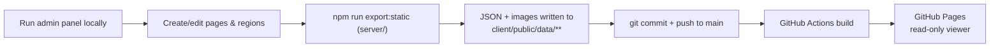

# Interactive Gemara Page Viewer

A web app for displaying scanned Gemara (Talmud) pages with interactive, invisible-by-default
hotspot regions overlaid on top of the original page image. An authenticated admin panel lets you
draw rectangle and polygon regions on a page image and attach a video, image, or text explanation
to each one. The public viewer renders those hotspots responsively, at any screen size, without
ever modifying the source image.

## Stack

- **Backend**: Node.js + Express + TypeScript, SQLite (`better-sqlite3`), JWT session cookies,
  `bcryptjs` password hashing, `multer` for image uploads.
- **Frontend**: React + TypeScript (Vite), React Router, Tailwind CSS v4, `dompurify` for sanitizing
  admin-authored text/HTML content before rendering it publicly.
- **Video**: embedded via YouTube/Vimeo iframe (URL is normalized to an embed URL automatically) —
  no video hosting/bandwidth cost. Direct file URLs also work as an `<iframe>` fallback.

## Project layout

```
server/   Express API, SQLite data model, auth, file uploads
client/   React admin panel + public viewer
```

## Data model

- **Page**: `tractate`, `daf`, `side` (`a`/`b`), `pageImageUrl`, optional natural image dimensions.
- **Region** (belongs to a page): `shape` (`rectangle` | `polygon`), `coordinates` stored as
  **percentages** of image width/height (not pixels) so hotspots stay aligned at any screen size,
  `contentType` (`video` | `image` | `text`), `content`, optional `title`.
  - Rectangle coordinates: `{ x, y, width, height }` (percent).
  - Polygon coordinates: `{ x, y }[]` (percent), minimum 3 points.

## Getting started

### 1. Backend

```bash
cd server
cp .env.example .env
```

Edit `.env` and set:
- `JWT_SECRET` — a long random string (e.g. `openssl rand -hex 32`)
- `ADMIN_USERNAME` / `ADMIN_PASSWORD` — the initial admin login. The admin account is created
  automatically the first time the server starts (only if no admin account exists yet).

```bash
npm install
npm run dev      # starts on http://localhost:4000
```

### 2. Frontend

```bash
cd client
npm install
npm run dev      # starts on http://localhost:5173, proxies /api and /uploads to :4000
```

Visit `http://localhost:5173` for the public viewer, or `http://localhost:5173/admin` to sign in
and manage pages (unauthenticated visitors are redirected to `/admin/login`).

### Production build

```bash
# server
cd server && npm run build && npm start

# client
cd client && npm run build   # outputs static files to client/dist, serve with any static host
```

To publish a read-only public viewer to GitHub Pages instead (no backend hosting required), see
[Deploying the public viewer to GitHub Pages](#deploying-the-public-viewer-to-github-pages) below.

## Admin workflow

1. **Admin → New Page**: enter tractate/daf/side and upload the scanned page image.
2. You're dropped into the **Region Editor**:
   - **Rectangle mode**: drag to draw.
   - **Polygon mode**: click to place each point; a rubber-band line follows the cursor to the
     last point. Close the shape by clicking near the starting point, double-clicking, or
     pressing **Enter**. **Escape** cancels the in-progress polygon.
   - **Select mode**: click a region to edit it in the side panel (title, content type, content).
     Drag the body to move a region; drag a rectangle's corner handles to resize; drag a polygon's
     vertex handles to reshape it; double-click a vertex to delete that point (leaving ≥3 points);
     press **Delete/Backspace** or use the "Delete region" button to remove a whole region.
3. **Save regions** sends the full region list to the backend as JSON, with coordinates normalized
   to percentages of the original image dimensions.

## Public viewer

The image renders at `width: 100%; height: auto` inside a `position: relative` wrapper. Rectangle
hotspots are `position: absolute` divs positioned with CSS percentages; polygons render as an SVG
`<polygon>` inside a `viewBox="0 0 100 100"` with `preserveAspectRatio="none"`. Because both
approaches are percentage/viewBox-based, they stay perfectly aligned to the image across any
screen size and on window resize with **no JavaScript recalculation needed** — the browser
recomputes percentages/viewBox scaling as part of normal layout. Regions are invisible until
hovered (a thin gold outline + subtle fill), and clicking one opens a modal with the matching
video/image/text content.

## Deploying the public viewer to GitHub Pages

GitHub Pages only serves static files — it can't run the Express/SQLite backend, so there is no
live admin editing on the deployed site. Instead, content is authored locally (where the real
backend and auth run) and then **exported** to static JSON that gets built into a read-only
viewer:



**One-time setup**, in the repo's GitHub settings: **Settings → Pages → Source → GitHub Actions**.
(The workflow at `.github/workflows/deploy-pages.yml` handles the rest.)

**Whenever you add/change content:**

```bash
# 1. Run the real backend + admin panel locally and edit pages/regions as usual
cd server && npm run dev
cd client && npm run dev   # http://localhost:5173/admin

# 2. Export the current database + uploaded images to static JSON
cd server && npm run export:static
# -> writes client/public/data/pages.json, client/public/data/pages/<id>.json,
#    and copies any /uploads/* images the regions/pages reference

# 3. Commit the exported data and push to main
git add client/public/data
git commit -m "Update published pages"
git push origin main
```

Pushing to `main` triggers the GitHub Actions workflow, which runs `npm run build:pages` (a Vite
build with relative asset paths and `VITE_DATA_MODE=static`, so the viewer reads the exported JSON
instead of calling `/api`) and publishes `client/dist` to GitHub Pages. The site will be available
at `https://<owner>.github.io/<repo>/`.

Locally, `npm run dev` and the regular `npm run build` are unaffected — they keep talking to the
live backend, so the admin panel and backend-driven workflow described above work exactly as
before; only `npm run build:pages` switches to static data.

## Auth

- Passwords are hashed with bcrypt (`bcryptjs`) — 12 salt rounds.
- Sessions are JWTs (12h expiry) stored in an `httpOnly`, `sameSite=lax` cookie — never exposed to
  client-side JS.
- `requireAdmin` middleware protects every `/api/admin/*` route (page/region CRUD, image upload);
  public `/api/pages*` routes remain open.
- The React admin routes are wrapped in `<ProtectedRoute>`, which redirects unauthenticated visitors
  to `/admin/login`.
- Single admin account, seeded from `ADMIN_USERNAME`/`ADMIN_PASSWORD` env vars on first boot. To
  rotate the password later, update the env vars and run `npm run seed:admin` from `server/`
  (upserts the admin row).

## Known trade-offs / notes for reviewers

- `react-router-dom` currently ships one open npm advisory (a CSRF bypass scoped to React Router's
  RSC/Server-Components "framework mode"). This project is a plain client-rendered SPA
  (`HashRouter`) and never uses that mode, so the advisory doesn't apply to this app's actual
  usage — but `npm audit` in `client/` will still flag it. Downgrading reintroduces ~13 other,
  more serious, previously-patched high-severity issues (XSS, RCE, DoS, open-redirect), so staying
  on latest was the deliberate choice here (see conversation for the full trade-off).
- Routing uses `HashRouter` (URLs like `/#/view/<id>`) rather than `BrowserRouter`, specifically so
  the GitHub Pages deployment below works with zero server-side rewrite configuration — GitHub
  Pages can't do SPA fallback routing, but a hash fragment never leaves the browser, so every route
  always resolves to the same `index.html`.
- Region content for `contentType: 'text'` is rendered with `dangerouslySetInnerHTML` after
  passing through `DOMPurify.sanitize()`, since admins can enter raw HTML.
