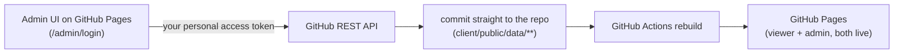
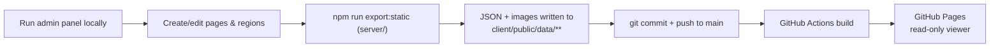

# Interactive Gemara Page Viewer

A web app for displaying scanned Gemara (Talmud) pages with interactive, invisible-by-default
hotspot regions overlaid on top of the original page image. An authenticated admin panel lets you
draw rectangle and polygon regions on a page image and attach a video, image, or text explanation
to each one. The public viewer renders those hotspots responsively, at any screen size, without
ever modifying the source image.

## Stack

- **Backend**: Node.js + Express + TypeScript, SQLite (`better-sqlite3`), JWT session cookies,
  `bcryptjs` password hashing, `multer` for image uploads.
- **Frontend**: React + TypeScript (Vite), React Router, Tailwind CSS v4, `dompurify` for sanitizing
  admin-authored text/HTML content before rendering it publicly.
- **Video**: embedded via YouTube/Vimeo iframe (URL is normalized to an embed URL automatically) —
  no video hosting/bandwidth cost. Direct file URLs also work as an `<iframe>` fallback.

## Project layout

```
server/   Express API, SQLite data model, auth, file uploads
client/   React admin panel + public viewer
```

## Data model

- **Page**: `tractate`, `daf`, `side` (`a`/`b`), `pageImageUrl`, optional natural image dimensions.
- **Video**: a standalone educational video shown on the `/videos` rail — `title`, optional `description`,
  `url` (YouTube/Vimeo), `sortOrder`. Unlike a region's video, it isn't attached to any daf.
- **Region** (belongs to a page): `shape` (`rectangle` | `polygon`), `coordinates` stored as
  **percentages** of image width/height (not pixels) so hotspots stay aligned at any screen size,
  `contentType` (`video` | `image` | `text`), `content`, optional `title`.
  - Rectangle coordinates: `{ x, y, width, height }` (percent).
  - Polygon coordinates: `{ x, y }[]` (percent), minimum 3 points.

## Getting started

### 1. Backend

```bash
cd server
cp .env.example .env
```

Edit `.env` and set:
- `JWT_SECRET` — a long random string (e.g. `openssl rand -hex 32`)
- `ADMIN_USERNAME` / `ADMIN_PASSWORD` — the initial admin login. The admin account is created
  automatically the first time the server starts (only if no admin account exists yet).

```bash
npm install
npm run dev      # starts on http://localhost:4000
```

### 2. Frontend

```bash
cd client
npm install
npm run dev      # starts on http://localhost:5173, proxies /api and /uploads to :4000
```

Visit `http://localhost:5173` for the public viewer, or `http://localhost:5173/admin` to sign in
and manage pages (unauthenticated visitors are redirected to `/admin/login`).

### Production build

```bash
# server
cd server && npm run build && npm start

# client
cd client && npm run build   # outputs static files to client/dist, serve with any static host
```

To publish this to GitHub Pages instead (no backend hosting required, admin editing optionally
included — see below), see [Deploying to GitHub Pages](#deploying-to-github-pages).

## Admin workflow

1. **Admin → New Page**: enter tractate/daf/side and upload the scanned page image.
2. You're dropped into the **Region Editor**:
   - **Rectangle mode**: drag to draw.
   - **Polygon mode**: click to place each point; a rubber-band line follows the cursor to the
     last point. Close the shape by clicking near the starting point, double-clicking, or
     pressing **Enter**. **Escape** cancels the in-progress polygon.
   - **Select mode**: click a region to edit it in the side panel (title, content type, content).
     Drag the body to move a region; drag a rectangle's corner handles to resize; drag a polygon's
     vertex handles to reshape it; double-click a vertex to delete that point (leaving ≥3 points);
     press **Delete/Backspace** or use the "Delete region" button to remove a whole region.
3. **Save regions** sends the full region list to the backend as JSON, with coordinates normalized
   to percentages of the original image dimensions.

## Interface language

The UI is Hebrew throughout, with `<html lang="he" dir="rtl">`. A few things follow from that and
are worth knowing before editing the UI:

- Use logical CSS utilities (`ms-`/`me-`, `ps-`/`pe-`, `start-`/`end-`, `text-start`/`text-end`)
  rather than physical left/right ones, so layout stays correct in both directions.
- Direction arrows are drawn with `<Chevron toward="start|end">`, not typed as characters. The
  obvious glyphs (`‹ › ← →`... specifically the angle quotes) are **bidi-mirrored**, so in an RTL
  document they silently render the opposite way and stop matching the control they sit on.
- A tractate name is Hebrew while its daf ("54b") is Latin. Rendering them as one string lets bidi
  reorder the pieces, so on-screen titles go through `<DafTitle>`, which isolates the name in a
  `<bdi>`. `formatPageTitle()` remains for alt text and aria-labels, where bidi doesn't apply.
- Arrow-key and swipe navigation in the viewer are mirrored: the *next* daf lies to the left.

## Videos rail

`/videos` shows standalone educational videos as plaques hanging from an aged wooden beam, scrolled
horizontally with snap points. Manage them at `/admin/videos` (linked from the admin dashboard):
add, edit, reorder, delete. In `github` admin mode each change commits `client/public/data/videos.json`;
in `express` mode they're rows in the `videos` table, exported to that same JSON by
`npm run export:static`. YouTube posters are derived from the video id; Vimeo has no thumbnail
without an API call, so those fall back to the site mark.

## Public viewer

The image renders at `width: 100%; height: auto` inside a `position: relative` wrapper. Rectangle
hotspots are `position: absolute` divs positioned with CSS percentages; polygons render as an SVG
`<polygon>` inside a `viewBox="0 0 100 100"` with `preserveAspectRatio="none"`. Because both
approaches are percentage/viewBox-based, they stay perfectly aligned to the image across any
screen size and on window resize with **no JavaScript recalculation needed** — the browser
recomputes percentages/viewBox scaling as part of normal layout. Regions are invisible until
hovered (a thin gold outline + subtle fill), and clicking one opens a modal with the matching
video/image/text content.

## Deploying to GitHub Pages

GitHub Pages only serves static files — it can't run the Express/SQLite backend. There are two
ways to publish the public viewer there; both use the same `npm run build:pages` / GitHub Actions
mechanics, they just differ in **how admin editing works once it's deployed**.

**One-time setup either way**, in the repo's GitHub settings: **Settings → Pages → Source → GitHub
Actions**. (The workflow at `.github/workflows/deploy-pages.yml` handles the rest, and is what
actually publishes `client/dist` after building it with `npm run build:pages`.)

### Option A — Fully GitHub-native admin (the default, `VITE_ADMIN_MODE=github` in `client/.env.pages`)

The admin panel itself runs as static JS on GitHub Pages, with **no backend at all**: every
"save" is a real git commit, made straight from your browser via the GitHub REST API, using a
personal access token you paste in once at `/admin/login`. There is no username/password — the
token *is* the credential. This means:



**Setup:**
1. Create a [fine-grained personal access token](https://github.com/settings/personal-access-tokens/new)
   scoped to **only this repository**, with **Contents: Read and write** permission and nothing else.
2. Push this repo to `main` once (so the workflow runs and Pages goes live).
3. Open `https://<owner>.github.io/<repo>/#/admin/login`, paste the token in, and use the admin
   panel exactly like the local one — create pages, draw regions, save. Every save commits directly
   to `main` and triggers a fresh Pages deploy (**allow ~1 minute** for a change to actually show up
   on the live site; a just-uploaded page image previews locally in that same browser tab in the
   meantime, but won't be reachable at its real URL — e.g. in a second tab, or after a reload —
   until that deploy finishes).

**Security, read this before using it:**
- Anyone with the URL can *open* `/admin/login` (GitHub Pages can't restrict who can load a page
  unless you're on GitHub Enterprise) — but without your token, they can't do anything: every
  write goes through GitHub's own auth, so an invalid/foreign token is simply rejected by GitHub,
  not by this app.
- The token is your website's admin password. Scope it to this one repo only, with only
  `Contents: read and write`, and treat it like any other secret. It's stored in this browser's
  `localStorage` — never sent anywhere except `api.github.com` — but that also means anyone with
  access to that browser/profile has it. Don't sign in on a shared or public computer, and revoke
  the token from GitHub's settings if you ever suspect it leaked.
- Set `VITE_ADMIN_MODE=express` in `client/.env.pages` instead (see Option B) if you'd rather not
  have a functioning admin panel reachable at a public URL at all.

### Option B — Read-only viewer, admin stays local (`VITE_ADMIN_MODE=express`)

Set `VITE_ADMIN_MODE=express` in `client/.env.pages` (or delete that line — it's the fallback) to
ship a GitHub Pages build whose `/admin` login form isn't backed by anything. Content is instead
authored against the real local backend and **exported** to static JSON:



```bash
# 1. Run the real backend + admin panel locally and edit pages/regions as usual
cd server && npm run dev
cd client && npm run dev   # http://localhost:5173/admin

# 2. Export the current database + uploaded images to static JSON
cd server && npm run export:static
# -> writes client/public/data/pages.json, client/public/data/pages/<id>.json,
#    and copies any /uploads/* images the regions/pages reference

# 3. Commit the exported data and push to main
git add client/public/data
git commit -m "Update published pages"
git push origin main
```

Either option: pushing to `main` triggers the GitHub Actions workflow, which runs
`npm run build:pages` (relative asset paths, `VITE_DATA_MODE=static` so the viewer reads exported/
committed JSON instead of calling `/api`) and publishes `client/dist` to GitHub Pages, live at
`https://<owner>.github.io/<repo>/`.

Locally, `npm run dev` and the regular `npm run build` are unaffected either way — they keep
talking to the live Express backend; only `npm run build:pages` switches modes.

## Auth

This app has two independent, mutually exclusive admin backends, selected at build time by
`VITE_ADMIN_MODE` (default `express` for `npm run build`/`npm run dev`; see the GitHub Pages
section above for the `github` mode used by `client/.env.pages`).

**`express` mode** (local dev, or any self-hosted deployment with the Express backend running):
- Passwords are hashed with bcrypt (`bcryptjs`) — 12 salt rounds.
- Sessions are JWTs (12h expiry) stored in an `httpOnly`, `sameSite=lax` cookie — never exposed to
  client-side JS.
- `requireAdmin` middleware protects every `/api/admin/*` route (page/region CRUD, image upload);
  public `/api/pages*` routes remain open.
- Single admin account, seeded from `ADMIN_USERNAME`/`ADMIN_PASSWORD` env vars on first boot. To
  rotate the password later, update the env vars and run `npm run seed:admin` from `server/`
  (upserts the admin row).

**`github` mode** (GitHub Pages with a live admin panel, see Option A above):
- There's no username/password or session — the credential is a GitHub personal access token,
  validated directly against the GitHub API (`checkRepoAccess` in `client/src/api/githubApi.ts`
  confirms the token can push to this repo) and stored client-side only (`localStorage`).
- Every admin write (`client/src/api/githubAdminClient.ts`) is a real commit via the GitHub
  Contents API — pages/regions live in `client/public/data/**` as JSON, with no database at all.

Both modes share `<ProtectedRoute>` (redirects unauthenticated visitors to `/admin/login`) and the
same admin UI components (`AdminDashboard`, `AdminPageEditor`, `RegionForm`, ...) — only the data
layer (`client/src/api/adminData.ts`) and the login form differ.

## Known trade-offs / notes for reviewers

- `react-router-dom` currently ships one open npm advisory (a CSRF bypass scoped to React Router's
  RSC/Server-Components "framework mode"). This project is a plain client-rendered SPA
  (`HashRouter`) and never uses that mode, so the advisory doesn't apply to this app's actual
  usage — but `npm audit` in `client/` will still flag it. Downgrading reintroduces ~13 other,
  more serious, previously-patched high-severity issues (XSS, RCE, DoS, open-redirect), so staying
  on latest was the deliberate choice here (see conversation for the full trade-off).
- Routing uses `HashRouter` (URLs like `/#/view/<id>`) rather than `BrowserRouter`, specifically so
  the GitHub Pages deployment below works with zero server-side rewrite configuration — GitHub
  Pages can't do SPA fallback routing, but a hash fragment never leaves the browser, so every route
  always resolves to the same `index.html`.
- Region content for `contentType: 'text'` is rendered with `dangerouslySetInnerHTML` after
  passing through `DOMPurify.sanitize()`, since admins can enter raw HTML.
